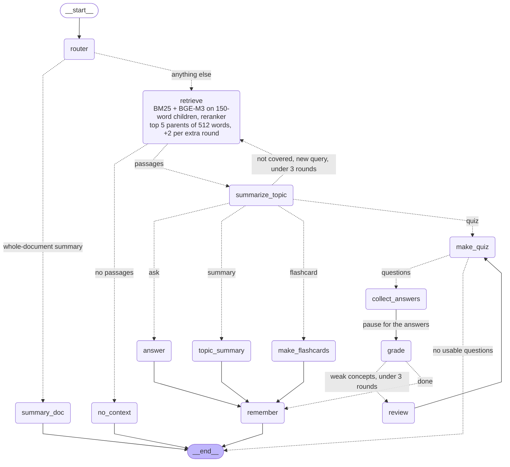
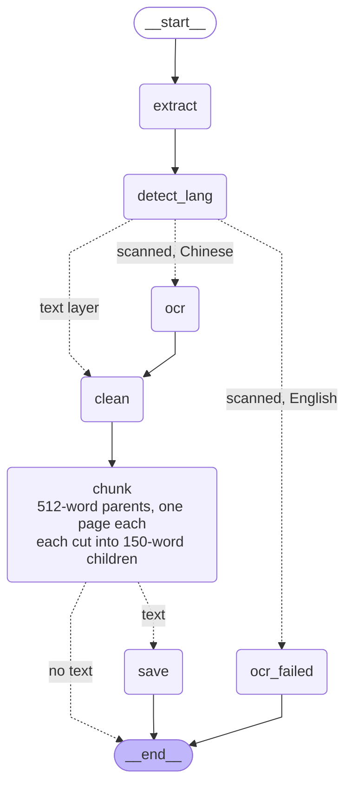
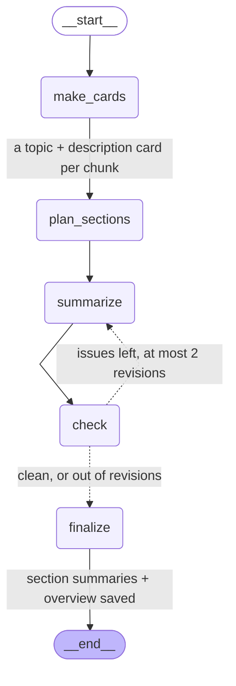
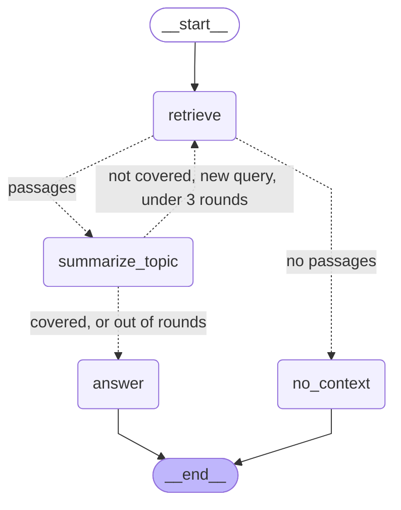

## StudyMate — PDF study assistant (RAG)

A chat-style study assistant for PDFs: ask questions, read chapter summaries, flip flashcards and take quizzes
that are graded and followed by a review of what you missed. Chinese and English documents; every reply is
written in the PDF's language and cites its pages.

**Retrieval:** parent-child. 512-word, sentence-aware parent chunks are cut into 150-word children; BM25 (jieba)
+ BGE-M3 dense (FAISS) search the children → Reciprocal Rank Fusion → bge-reranker-v2-m3 → each child is
swapped for its parent, and the top 5 parents go to the LLM.
**Generation:** DeepSeek (`deepseek-flash`) through LangChain, or local Ollama without a key, orchestrated
with LangGraph (topic notes + up to 3 search rounds, chunk cards, per-document memory).

**Headline numbers** (271 answerable questions on 6 books, page-level, `eval_out/20261009-234502` and
`eval_out/Retrieval Final Test`):

| | v1: 800-character chunks | v2: 150-word children → 512-word parents |
|---|---|---|
| Hybrid RRF + reranker, Recall@1 | 0.871 | **0.878** |
| Hybrid RRF + reranker, MRR | 0.921 (en 0.908, zh 0.939) | **0.924** (en 0.913, zh 0.938) |
| Same chunk size in both languages | no: Chinese chunks hold 2x the tokens of English | yes: ~170-180 BGE-M3 tokens each |
| Text the LLM gets per hit | one 800-character chunk | the whole 512-word parent |
| Answer faithfulness (30 questions) | 0.942 | **0.994** |
| English questions answered in Chinese (30 questions) | 14 of 20 | **0** |

---

### Contents

1. [What changed in v2](#1-what-changed-in-v2)
2. [Results](#2-results)
3. [Why 150-word children: the reasoning and the data](#3-why-150-word-children-the-reasoning-and-the-data)
4. [Example: one page chunked old and new, one question traced](#4-example-one-page-chunked-old-and-new-one-question-traced)
5. [How the system works, file by file](#5-how-the-system-works-file-by-file)
6. [Project structure](#6-project-structure)
7. [Benchmarks: data, metrics, commands, result folders](#7-benchmarks-data-metrics-commands-result-folders)
8. [Installation, running, API](#8-installation-running-api)
9. [Known limitations](#9-known-limitations)

---

### 1. What changed in v2

v1 is the state of commit `1b0c852` (6 Oct 2026) and the 4 Oct benchmark runs. v2 is this version.

| Area | v1 | v2 | Why (data in section 3) |
|---|---|---|---|
| **Chunk unit** | up to 800 characters per page, 120-character overlap | up to 512 words per page, 1 sentence overlap (the parent) | characters are not comparable across languages; words are |
| **Sentences** | one regex for both languages; silently dropped every non-Chinese piece under 18 characters (0.7-7% of each book's text: code lines, headings, "Exercises") | English: Moses punctuation normalizer + sentence splitter; Chinese: split after 。！？； | no cut inside a sentence, no lost text |
| **Counting size** | characters | words: English `text.split()`, Chinese jieba words (我们去图书馆 = 3) | ~1.55 BGE-M3 tokens per word in **both** languages |
| **Search unit** | the 800-character chunk | **150-word children** (cut from each parent at sentence boundaries, no overlap) | small units search precisely; the reranker still needs ~120+ words of context |
| **What the LLM reads** | the same 800-character chunk | the child's **512-word parent** (duplicates dropped) | more context per hit for the answer |
| **Language detection** | none per document: OCR always `chi_sim`, prompts said "the document's language" | `detect_lang`: share of 汉字 in 汉字 + A-Z ≥ 10%, majority of 5 sampled pages; drives sentence splitting, word counting, OCR and the reply language | 0-1% wrong over 200 sampling seeds on the 6 books |
| **Cleaning** | headers/footers, known noise | + contents-page dot leaders `. . . .` removed (one contents chunk was 3,627 tokens; now ≤ 467) | dot leaders became tokens and filled whole chunks |
| **Dense index** | BGE-M3, 512 tokens | BGE-M3, 512 tokens, one FAISS index per document *and child set* (`Data/Cache/bge_m3_children/w150/`), rebuilt automatically when the texts change (fingerprint) | |
| **Reranker** | `max_length` 512 | `max_length` 8192 (nothing is cut), batch 16 | |
| **Child sets** | – | several sizes side by side in `child_chunks`, keyed by `(child_words, child_overlap)`: `150`, `150o40`, ... | lets the benchmark compare sizes and overlaps on the same parents |
| **Study graph** | retrieve → answer, top 8 chunks | router → retrieve ⇄ summarize_topic (notes; up to 3 search rounds) → answer / summary / flashcards / quiz → remember; top 5 parents | answers written from notes + pages, follow more than one page |
| **Chunk cards** | – | a topic + 1-2 sentence description per parent, shown to the LLM next to the page text; also the source of the section summaries | cards are **not** searched: card search + reranker MRR 0.817 vs 0.911 on the page text (`eval_out/20261008-192124`) |
| **Memory** | the chat's messages (checkpointed per thread) | per chat: running summary + last turn's chunks; per document (all chats): topics studied and quiz mastery in a LangGraph store (`Data/Database/memory.db`) | |
| **Reply language** | soft rule ("language of the document text"), which the model ignored | the code detects the PDF's language once (`store.doc_language`) and every prompt that writes for the student says "write in English / Chinese" | 55/55 replies in the PDF's language (was 26/55) |
| **Prompts** | free-form | every prompt: ROLE → INPUT → numbered STEPS → RULES | |
| **Benchmark tooling** | 1 retriever list | `sweep` over child sizes and overlaps (quality next to cost), `run` accepts `hybrid_rrf+reranker@150` / `@150o40`; generation benchmark runs the app's own graph | |
| **Environment** | most packages unpinned | packages pinned to the tested versions; the Docker build fails if any app module cannot import | |

---

### 2. Results

All retrieval numbers: 271 answerable questions (L1-L4) out of 300, 6 books, page-level ranking (a page counts
once, at its best chunk), MRR over the top 50. With 271 questions, differences below about **0.02 MRR** are
within noise (95% confidence interval ±0.02-0.03).

**Retrieval** — v1 from `eval_out/Retrieval Final Test` (old database), the other two columns from one run,
`eval_out/20261009-234502`:

| Retriever | v1: 800-char chunks<br>R@1 / R@5 / MRR | 512-word chunks<br>R@1 / R@5 / MRR | **v2: 150-word children** (app)<br>R@1 / R@5 / MRR |
|---|---|---|---|
| TF-IDF (v0 app pipeline) | 0.609 / 0.830 / 0.703 | 0.554 / 0.801 / 0.661 | – |
| BM25 (jieba) | 0.686 / 0.878 / 0.774 | 0.690 / 0.889 / 0.778 | 0.686 / 0.871 / 0.767 |
| BGE-M3 dense | 0.712 / 0.937 / 0.811 | 0.565 / 0.841 / 0.684 | 0.705 / 0.930 / 0.802 |
| Hybrid RRF | 0.727 / 0.941 / 0.823 | 0.642 / 0.889 / 0.751 | 0.734 / 0.934 / 0.823 |
| **Hybrid RRF + reranker** | 0.871 / 0.978 / 0.921 | 0.867 / 0.974 / 0.911 | **0.878 / 0.974 / 0.924** |
| reranker time per query | – | 894 ms | **352 ms** |

By language (MRR): hybrid RRF v1 en 0.836 / zh 0.804 → v2 en 0.827 / zh 0.817; with the reranker v1 en 0.908 /
zh 0.939 → v2 en 0.913 / zh 0.938. The Chinese books gain the most in the first stage, because their old chunks
were twice the size of the English ones (section 3.1).

**Generation, before vs after** — the same 30 questions (`run --limit 30`), judged by the same DeepEval
faithfulness check (claims checked against the pages shown; "borderline" counts as unsupported).
Before = `eval_out/Generate Final Test` (v1, 8 chunks of 800 characters, single answer prompt). After =
`eval_out/generation_k5_children` (v2 app). Paired rows: `generation_k5_children/compare_before_after.csv`.

| | Before (v1) | After (v2) |
|---|---|---|
| Faithfulness (26 judged answers) | 0.942 | **0.994** |
| Fully faithful answers | 21/26 | **24/26** |
| Unsupported claims | 6 of 133 | **2 of 251** |
| English questions answered in Chinese | 14/20 | **0/20** |
| Gold page shown / gold page cited / L5 correctly refused | 26/26 · 26/26 · 4/4 | 26/26 · 26/26 · 4/4 |
| Context given to the model (median) | 8 chunks, ~1,000 words | 5 parents, ~2,100 words |
| Answer length (median) | ~55 words | ~150 words: the answer, then supporting details with page numbers |

More than the chunking changed between these two runs (prompts, notes loop, chunk cards), so read this as v1 app
vs v2 app. One answer got worse (macro-042, 1.00 → 0.91). The v1 run of all 300 questions scored faithfulness
0.981 (`Generate Final Test/summary_raw.csv`).

**Reply language, before vs after** — the same 55 questions (all 45 L3 questions, which are asked in the other
language than the book, plus 10 L1/L2), today's pipeline with the old and the new language rule.
`eval_out/language_check_k5/compare_language.csv`:

| | Old rule | PDF language (v2) |
|---|---|---|
| Replies in the PDF's language | 26/55 | **55/55** |
| Chinese question about an English book | 1/30 | **30/30** |
| English question about a Chinese book | 11/11 | 11/11 |
| Faithfulness (judged answers) | 0.985 | 0.994 |

With the old rule the model wrote Chinese whenever Chinese appeared anywhere. Two questions were refused in the
new run (clrs-018, clrs-035); in both, a later search round pushed the gold page out of the 5 passages (one of
them is an English question about an English book, so the language rule is the same either way).

---

### 3. Why 150-word children: the reasoning and the data

#### 3.1 800 characters meant different amounts of text per language

The same measurement for each unit, 4 English books (CLRS, SLP3, macro, investor) and 2 Chinese books (d2l-zh,
LLMBook-zh). Words = `text.split()` for English, jieba words for Chinese; tokens = the BGE-M3 tokenizer;
median per unit:

| Unit | Lang | Count | Chars | 汉字 | Words | BGE-M3 tokens | Over 512 tokens | Tokens per word |
|---|---|---|---|---|---|---|---|---|
| v1 800-char chunk | en | 11,064 | 717 | – | 122 | 183 | 0% | 1.57 |
| v1 800-char chunk | zh | 2,438 | 742 | 204 | 203 | **373** | 6% | 1.60 |
| v2 512-word parent | en | 3,152 | 2,116 | – | 379 | 560 | **63%** | 1.55 |
| v2 512-word parent | zh | 1,312 | 913 | 358 | 324 | 525 | **54%** | 1.55 |
| **v2 150-word child** | en | 9,362 | 669 | – | **120** | **178** | 0% | 1.53 |
| **v2 150-word child** | zh | 3,600 | 269 | 158 | **118** | **167** | 1% | 1.55 |

- A character limit gives a Chinese chunk **twice the tokens** of an English one (373 vs 183), because one 汉字
  carries more meaning than one Latin letter. Retrieval units of very different sizes are not compared fairly by
  BM25 or by the dense vector.
- Counted in words (jieba for Chinese), both languages land at **~1.55 BGE-M3 tokens per word**. So a word limit
  means the same amount of text, and the same number of model tokens, in both languages. That is the benefit of
  tokenizing before chunking: the size limit is in the unit the models actually read.
- A 150-word child is **the size of the old English chunk** (120 words, 178 tokens) in both languages, and every
  child fits BGE-M3's 512-token window with room to spare.
- A 512-word parent is too big to *search*: 54-63% exceed BGE-M3's 512-token window and would be cut, and one
  vector for a whole page blurs its topics (dense MRR 0.684, vs 0.802 for the children). It is the right size to
  *read*, so it is what the LLM gets.

#### 3.2 Small chunks are precise, big chunks give context: parent-child

The two stages of retrieval want different sizes:

- **Stage 1, BM25 + BGE-M3 (bi-encoder):** one vector per unit. A small unit is about one thing, so its vector
  matches a question precisely. Big units get squeezed into one vector (and truncated past 512 tokens).
- **Stage 2, the reranker (cross-encoder):** reads the question and the whole unit together. It needs enough text
  to see that the unit actually answers the question: with too small a unit, the question's terms and the answer
  end up in different pieces.
- **The answer (LLM):** wants the most context.

So the app searches small **children** and gives the LLM their **parent**: precision for finding, context for
answering. The parent is 512 words, one page at most (chunks never cross pages, so every citation is exact).

#### 3.3 The child-size sweep, from too small to too big

MRR on the same 271 questions. Stage 1 = hybrid RRF without reranker; + reranker = the app's pipeline.
"Items" = indexed units over the 6 books.

| Search unit | Items | Dense MRR | Hybrid RRF MRR | + reranker MRR | Source (`eval_out/`) |
|---|---|---|---|---|---|
| 64-word children | 31,383 | 0.812 | 0.828 | – | Mass Chunking |
| 80 | 24,511 | 0.818 | 0.817 | – | Mass Chunking |
| 90 | 21,599 | 0.818 | 0.825 | – | Mass Chunking |
| 100 | 19,333 | 0.823 | 0.822 | 0.886 | Mass Chunking, Chunking sweep |
| 105 | 18,379 | – | – | 0.904 | Chunking sweep |
| 110 | 17,467 | 0.818 | 0.830 | 0.899 | Mass Chunking, Chunking sweep |
| 128 | 15,176 | 0.796 | 0.812 | – | Mass Chunking |
| 140 | 13,796 | 0.803 | 0.826 | – | Mass Chunking |
| **150** | 12,962 | 0.802 | 0.823 | **0.924** | 20261009-234502 |
| 160 | 12,304 | – | 0.825 | 0.922 | 20261009-195448, Chunking Test 150 ~ 200 |
| 170 | 11,689 | – | – | 0.918 | Chunking Test 150 ~ 200 |
| 180 | 10,969 | – | – | 0.918 | Chunking Test 150 ~ 200 |
| 256 | – | 0.759 | 0.800 | 0.914 | Retrieval (New Chunking method) |
| 512-word chunks, no children | 4,464 | 0.684 | 0.751 | 0.911 | 20261009-234502 |
| v1 800-char chunks | 13,502 | 0.811 | 0.823 | 0.921 | Retrieval Final Test |

What the sweep shows:

- **Stage 1 is flat from 64 to 160 words** (hybrid 0.81-0.83) and drops for big units (256: 0.800, 512: 0.751):
  that is the one-vector squeeze.
- **The reranker rises from 100 to 150 words** (0.886 → 0.924), then levels off and falls slightly (160: 0.922,
  170-180: 0.918, 256: 0.914, 512: 0.911). Below ~120 words it lacks context. On a copy of the database, giving the
  reranker each 105-word child plus its neighbour on each side brought it from 0.904 to 0.918 with the same
  candidates (a bigger candidate pool did not help: 0.907), which confirms that context, not recall, was missing.
- **150 words is the peak**, it is also the cheapest of the good sizes (reranker 352 ms per query vs 894 ms on
  512-word chunks), and it equals the old English chunk size, so English keeps what worked in v1 while Chinese
  gets units of the same size.

#### 3.4 Overlap between children: tested, not used

Overlapping children (each child also starts ~N words before the previous one ends, whole sentences) were
benchmarked as child sets `150o15`, `150o20`, `150o40`, `160o20`, `160o40`:

| Child set | Hybrid RRF MRR | + reranker MRR |
|---|---|---|
| **150, no overlap** | 0.823 | **0.924** |
| 150 + 15 overlap | – | 0.918 |
| 150 + 20 overlap | – | 0.913 |
| 150 + 40 overlap | 0.821 | – |
| 160, no overlap | 0.825 | 0.922 |
| 160 + 20 overlap | – | 0.917 |
| 160 + 40 overlap | 0.833 | 0.915 |

(`eval_out/20261009-195448` and `20261009-212147`; 160 + 40 full run: `Latest  Retrieval`.) Overlap helps stage 1
a little on the Chinese books but never the reranker, probably because near-duplicate children of one page take
up places in the reranker's 30-candidate pool. The app uses **150 words, no overlap** (`CHILD_WORDS = 150`, `CHILD_OVERLAP = 0` in
`src/pdf/chunker.py`); the overlap option stays in the code for benchmarking.

---

### 4. Example: one page chunked old and new, one question traced

Page 251 of *Dive into Deep Learning* (d2l-zh, CC BY-SA 4.0), §6.2.3 edge detection with a convolution kernel.

**v1, 800 characters:** two chunks; the second repeats the first one's last sentence (overlap) and keeps the
extraction noise "(continues on next page)":

```
[c0] 783 chars  "6.2.3 图像中目标的边缘检测如下是卷积层的一个简单应用:通过找到像素变化的位置,来检测图像中不同颜色的边缘。 首先, ..."
[c1] 164 chars  "其输出如下,之前检测到的垂直边缘消失了。 不出所料,这个卷积核K只可以检测垂直边缘,无法检测水平边缘。 corr2d(d ... (continues on next page) 图像卷积 233"
```

**v2:** one parent (the whole page, 880 characters, noise removed) and three children cut at sentence boundaries,
near-equal in jieba words (code tokens count as words, so the code-heavy children are longer in characters):

```
[p251:c0]             parent, 880 chars  -> what the LLM reads
[p251:c0:w150:k0]     364 chars  "6.2.3 图像中目标的边缘检测如下是卷积层的一个简单应用:通过找到像素变化的位置,来检测图像中不同颜色的边缘。首先,我们构造一个6 × 8 ..."
[p251:c0:w150:k1]     139 chars  "当进行互相关运算时,如果水平相邻的两元素相同,则输出为零,否则输出为非零。K = np.array([[1.0, -1.0]]) ..."
[p251:c0:w150:k2]     377 chars  "Y = corr2d(X, K) ... 6.2. 图像卷积 233"
```

**One benchmark question through the app's retrieval** (d2l-zh-021, gold page 251):
"用[1, -1]卷积核进行互相关检测边缘时,为什么把图像转置后就检测不到边缘了?"

| Step | Result |
|---|---|
| Hybrid RRF, top 5 children | p251·k2, p254·k0, p251·k1, p251·k0, p253·k1 |
| Reranker (30 candidates), top 5 children | p251·k2 **0.989**, p251·k1 0.733, p254·k0 0.661, p252·k0 0.640, p251·k0 0.439 |
| Swapped for parents, duplicates dropped → LLM | p251 (0.989), p254 (0.661), p252 (0.640), p249 (0.321), p654 (0.301) |

Three children of page 251 collapse into one parent, so the LLM gets 5 *different* pages, the gold page first.

---

### 5. How the system works, file by file

**Upload → stored chunks** (`server/http_server.py` → `src/ingest.py`, a LangGraph):

1. `web/index.html` posts the PDF to `POST /api/upload` (`server/http_server.py`).
2. `src/ingest.py: ingest_pdf` runs the PDF graph:
   - `extract` — `src/pdf/extractor.py` reads the text layer page by page (PyMuPDF); `src/pdf/ocr_fallback.py:
     needs_ocr` decides whether the PDF is scanned.
   - `detect_lang` — `src/pdf/chunker.py: detect_lang` (汉字 share ≥ 10% on the majority of 5 sampled pages).
   - `ocr` — Tesseract `chi_sim` for scanned Chinese PDFs (`ocr_fallback.py`); a scanned English PDF stops at
     `ocr_failed`.
   - `clean` — `src/pdf/cleaner.py`: repeated headers/footers, known noise (MXNet logs, "continues on next
     page", code-wrap marks), contents dot leaders, hyphenation.
   - `chunk` — `Chunker.chunk_pages`: sentences (Moses / 。！？；), packed into ≤ 512-word parents per page;
     `Chunker.children`: each parent cut into ≤ 150-word children.
   - `save` — `src/db/repository.py: replace_doc_content_atomic` writes pages, chunks and children to
     `Data/Database/app.db` in one transaction (the chunk card of every unchanged chunk is kept on re-ingest).
3. `src/retrieval/hybrid.py: warm_up` builds the BM25 index (memory) and the BGE-M3 FAISS index of the
   children (`Data/Cache/bge_m3_children/w150/<doc_id>/`).
4. `src/graphs/ingest_graph.py` (background): `make_cards` writes a card per parent (`chunk_cards` table) →
   `plan_sections` (PDF contents) → `summarize` → `check` → `finalize` →
   `Data/Cache/summaries/<doc_id>.json`.

**Question → answer** (`POST /api/chat` → `src/graphs/study_graph.py`):

1. `router` (`src/graphs/nodes.py`, prompt in `src/graphs/prompts.py`, schema in `src/graphs/schemas.py`):
   intent (ask / summary / flashcard / quiz), scope, follow-up, standalone search query.
2. `retrieve` → `nodes._search` → `src/retrieval/hybrid.py: hybrid_search` → `parent_child_rerank`:
   `bm25_index.py` (jieba tokens, Okapi BM25) and `dense_index.py` (BGE-M3, FAISS) over the 150-word children,
   50 candidates each → `rrf_fuse` (k = 60) → `reranker.py` (bge-reranker-v2-m3) on the top 30 → children
   swapped for their parents (`repository.get_children_by_ids`, `get_chunks_by_ids`), duplicates dropped →
   top 5 parents, each with its chunk card.
3. `summarize_topic` writes notes (main idea + key points with pages) and says whether they cover the request;
   if not, it writes the next query and `retrieve` runs again (+2 parents, at most 5 kept, at most 3 rounds).
4. `answer` / `topic_summary` / `make_flashcards` / `make_quiz` (→ `collect_answers` pause → `grade` →
   `review` → new quiz) write from the notes and the parents, in the PDF's language
   (`src/graphs/store.py: doc_language` → `prompts.lang_rule`). The LLM is picked in `src/llm_client.py`.
5. `remember` (`src/graphs/memory.py`) saves the topic and quiz mastery in the document's memory
   (`Data/Database/memory.db`) and folds older messages into the chat's running summary. Chat state is
   checkpointed per thread in `Data/Database/checkpoints.db`. The server streams every step to the browser as
   server-sent events.

#### LangGraph diagrams

Sources in `docs/*.mmd`, rendered PNGs next to them. Dashed edges are conditional; their labels say when they are
taken.

**Study graph** (`src/graphs/study_graph.py: build_study_graph`):



**PDF ingest graph** (`src/ingest.py: build_pdf_graph`):



**Ingest graph: chunk cards + section summaries** (`src/graphs/ingest_graph.py: build_ingest_graph`):



**Answer graph** (`src/graphs/study_graph.py: build_answer_graph`, the question path without router and
memory; what `scripts/eval_generation.py` runs):



---

### 6. Project structure

```
studymate/
├── README.md                    # this file
├── environment.yml              # conda env "studymate": Python 3.11, CUDA 12.8 PyTorch, Tesseract, Perl, pinned packages
├── Dockerfile                   # Linux image built from environment.yml; fails the build if Moses or any app module breaks
├── compose.yaml                 # runs the image with the GPU, .env, BGE-M3, the HF cache, Data/ and uploads/
├── .dockerignore                # allowlist: only environment.yml, src/, server/, web/ go into the image
├── .env                         # your API key and settings (create it; not in git)
├── Langgraph Summary.png        # the study graph (same as docs/study_graph.png)
├── server/
│   └── http_server.py           # async FastAPI: upload, chat (SSE), quiz answers, summaries, PDF; serves web/
├── web/
│   └── index.html               # the chat UI
├── src/
│   ├── ingest.py                # PDF graph: extract -> detect_lang -> (ocr) -> clean -> chunk -> save;
│   │                            #   CLI: --children <doc|all> [size] [overlap], --drop-children <size> [overlap]
│   ├── llm_client.py            # DeepSeek (deepseek-flash) when DEEPSEEK_API_KEY is set, else Ollama
│   ├── pdf/
│   │   ├── extractor.py         # text layer per page (PyMuPDF)
│   │   ├── ocr_fallback.py      # scanned or not; Tesseract OCR (finds the env's tesseract + tessdata itself)
│   │   ├── cleaner.py           # headers/footers, extraction noise, dot leaders, hyphenation
│   │   ├── chunker.py           # detect_lang, Moses / Chinese sentences, 512-word parents, 150-word children
│   │   └── test.py              # manual check of extraction / OCR / chunking on two PDFs (not used by the app)
│   ├── retrieval/
│   │   ├── hybrid.py            # THE retrieval pipeline (app + benchmark): BM25 + dense -> RRF -> reranker -> parents
│   │   ├── bm25_index.py        # Okapi BM25 over jieba tokens, one in-memory index per document and unit
│   │   ├── dense_index.py       # BGE-M3 encoder + FAISS index per document and unit, cached on disk
│   │   ├── reranker.py          # bge-reranker-v2-m3 cross-encoder (max_length 8192)
│   │   ├── tfidf_index.py       # v0 TF-IDF baseline, kept for the benchmark
│   │   └── search.py            # v0 TF-IDF search pipeline (threshold, MMR), kept for the benchmark
│   ├── graphs/                  # LangGraph
│   │   ├── study_graph.py       # the chat graph (+ the answer graph the generation benchmark runs)
│   │   ├── ingest_graph.py      # chunk cards -> section summaries -> check -> overview
│   │   ├── nodes.py             # every node of the study graph; TOP_K = 5, MORE_K = 2, MAX_HOPS = 3
│   │   ├── prompts.py           # every prompt (ROLE / INPUT / STEPS / RULES), lang_rule()
│   │   ├── schemas.py           # what the LLM must return (structured output)
│   │   ├── state.py             # what flows between nodes and is checkpointed
│   │   ├── memory.py            # per-document long-term memory (LangGraph store)
│   │   └── store.py             # shared repository, summary cache, doc_language()
│   └── db/
│       ├── schema.py            # SQLite tables: documents, pages, chunks, child_chunks, chunk_cards
│       ├── models.py            # dataclasses; child_unit() / parse_child_unit() name child sets (150, "150o40")
│       └── repository.py        # all SQL
├── scripts/
│   ├── eval_retrieval.py        # retrieval benchmark: add questions, `run`, `sweep` child sizes / overlaps
│   ├── eval_generation.py       # answer benchmark: the app's answer graph + DeepEval faithfulness judge
│   ├── chunks.py                # sample chunks of a book to write benchmark questions from
│   ├── clean_noise.py           # apply the cleaner's noise rules to documents already in the database
│   └── Cara pake evaluation.txt # short how-to for the benchmark (Indonesian)
├── eval/
│   ├── questions.jsonl          # the benchmark: 300 questions, 6 books (section 7)
│   ├── questions_v1.0.jsonl     # the question file before the v1.1 review
│   └── docs.json                # doc_id -> short book name
├── eval_out/                    # benchmark results (section 7 lists what each folder is)
├── docs/
│   ├── study_graph.mmd/.png  answer_graph.mmd/.png  ingest_graph.mmd/.png  pdf_ingest_graph.mmd/.png
│   ├── child-chunks-v2-plan.md  # the plan and status of the child-chunk change
│   └── archive/                 # the 7 Oct diagrams
├── sample/                      # sampled chunks and drafted questions per book
├── Data/                        # created at runtime, not in git
│   ├── Database/                # app.db (documents, pages, chunks, children, cards), checkpoints.db (chats), memory.db
│   ├── Cache/                   # bge_m3/ (512-word chunks), bge_m3_children/w150/ (children), tfidf/, summaries/
│   └── pdfs/                    # PDFs ingested from the command line
└── uploads/                     # PDFs uploaded through the UI, not in git
```

---

### 7. Benchmarks: data, metrics, commands, result folders

**Data** (`eval/questions.jsonl`): 300 questions, 50 per book, written from sampled chunks and reviewed against
the pages (v1.1 rules: a page is gold only if it answers the question by itself).

| Book (`doc`) | Language | Pages |
|---|---|---|
| clrs — Cormen et al., *Introduction to Algorithms* | en | 1313 |
| p300 — Jurafsky & Martin, *Speech and Language Processing* (3rd ed. draft) | en | 646 |
| macro — Doepke, Lehnert & Sellgren, *Macroeconomics* | en | 296 |
| investor — Graham, *The Intelligent Investor* (with Zweig's commentary) | en | 641 |
| d2l-zh — 《动手学深度学习》 | zh | 813 |
| LLMbookzh — 《大语言模型》 赵鑫 等 | zh | 391 |

Levels: **L1** 111 (same words as the page) · **L2** 91 (paraphrased) · **L3** 45 (asked in the other language:
Chinese or code-mixed questions on English books, English questions on Chinese books) · **L4** 24 (needs 2+
pages; `gold_groups`) · **L5** 29 (not in the book; scored by abstention).

**Metrics.** Retrieval: Recall@k = a gold page in the top k; Full@k = every answer part (gold group) in the top k;
MRR@50; rankings are page-level. Generation: DeepEval faithfulness with the app's own LLM as judge at temperature 0,
claims checked against the exact pages the model saw, borderline = unsupported; plus Answered (L1-L4), Abstain
(L5), CiteValid, CiteGold.

**Commands**

```powershell
python scripts/eval_retrieval.py run                                    # every retriever + the app's child set (@150)
python scripts/eval_retrieval.py run hybrid_rrf+reranker@150 hybrid_rrf+reranker@150o20
python scripts/eval_retrieval.py sweep hybrid_rrf+reranker 100 150 200  # child sizes: quality next to cost
python scripts/eval_retrieval.py sweep hybrid_rrf 150 150o40 160 160o40 # with and without overlap
python -m src.ingest --drop-children 160 40                             # remove a child set tried in a sweep
python scripts/eval_generation.py run --limit 30                        # answers + faithfulness on 30 questions
python scripts/eval_generation.py run                                   # all 300 (k = 5 parents, children)
python scripts/eval_generation.py labels / agree                        # hand labels vs the judge
```

A child set that does not exist yet is cut from the stored parents on first use (no PDF, no LLM), and its dense
index is built once. Both scripts import the code the server runs, so their numbers describe the live app.

**Result folders** (`eval_out/`)

| Folder | What it is |
|---|---|
| `Retrieval Final Test` | v1 retrieval, 800-character chunks (4 Oct) |
| `Generate Final Test` | v1 generation, all 300 questions, k = 8 chunks (4 Oct) |
| `Test Result*` | earlier runs on the 180/181-question version of the benchmark |
| `20261008-192124`, `20261008-195906` | after re-chunking to 512-word chunks; `cards_rrf` = searching chunk cards (rejected) |
| `generation_k8` | generation on 512-word chunks (8 Oct, judging incomplete) |
| `Retrieval (New Chunking method)` | 512-word chunks vs 256-word children |
| `Chunking 128 vs 512` | 512-word chunks vs 128-word children |
| `Mass Chunking` | stage-1 sweep, children of 64-140 words |
| `Chunking sweep` | reranker on children of 100, 105, 110 words |
| `Chunking Test 150 ~ 200 (Terbaik)` | reranker on children of 150-180 words: 150 best |
| `20261009-195448` | hybrid RRF on 150 / 150o40 / 160 / 160o40 |
| `20261009-212147` | reranker on 150 / 150o15 / 150o20 / 160o20 |
| `Latest  Retrieval` | full run with 160 + 40 overlap children |
| **`20261009-234502`** | **full run of the final setup (150-word children)** |
| `generation_k5_children` | v2 generation, 30 questions; `compare_before_after.csv` pairs it with v1 |
| `language_check_k5` | reply language, old rule vs PDF language, 55 questions; `compare_language.csv` |

---

### 8. Installation, running, API

#### Requirements

- Windows 10/11 with [Miniconda / Anaconda](https://www.anaconda.com/download) (option A) or
  [Docker Desktop](https://www.docker.com/products/docker-desktop/) with the WSL 2 backend (option B)
- An NVIDIA GPU is recommended for BGE-M3 and the reranker; without one they run on the CPU, slower
- A [DeepSeek](https://platform.deepseek.com/) API key, or [Ollama](https://ollama.com/) running locally
- Disk: about 7 GB for the two models, plus about 6 GB for the Docker image (option B only)

#### Installation

**1. Get the code**

```powershell
git clone https://github.com/Justin-75/studymate.git
cd studymate
```

**2. Configure the LLM.** Create a `.env` file in the project root:

```env
DEEPSEEK_API_KEY=your_key_here      # exactly this name; leave out to use local Ollama instead
OLLAMA_MODEL=mistral-nemo:12b       # used only when there is no DeepSeek key
CHECK_FAITHFULNESS=0                # 1 = LLM-check every section summary (about 2x the cost)
STUDYMATE_RETRIEVAL_UNIT=children   # default: search 150-word children, answer from their 512-word parents; chunks = search the 512-word chunks
```

**3. Download BGE-M3** (dense retrieval, about 4.3 GB) into `E:\models\bge-m3`. Both CLIs come with the conda
environment from step 4A; for option B, `pip install huggingface_hub` is enough.

```powershell
hf download BAAI/bge-m3 --local-dir E:\models\bge-m3
# or, from mainland China:
modelscope download --model BAAI/bge-m3 --local-dir E:\models\bge-m3
```

Another folder works too: set `BGE_M3_PATH` in `.env` (and the `E:/models/bge-m3` volume in `compose.yaml` for
Docker). Without the folder the app downloads `BAAI/bge-m3` from Hugging Face on first use. The reranker
(`BAAI/bge-reranker-v2-m3`, about 2.3 GB) downloads itself into the Hugging Face cache on first use.

**4A. Option A: conda**

```powershell
conda env create -f environment.yml
conda activate studymate
python server/http_server.py
```

`environment.yml` holds everything: Python 3.11, PyTorch with CUDA 12.8 (RTX 50-series and older NVIDIA cards),
Tesseract OCR with Chinese and English data (scanned PDFs), Perl (runs the Moses sentence splitter for English
text) and the Python packages, pinned to the versions the benchmarks above were measured with. After pulling:
`conda env update -f environment.yml`.

**4B. Option B: Docker**

```powershell
docker compose up --build
```

The first build takes about 15 minutes and produces a 6 GB image; later starts take seconds. The image installs
the same `environment.yml` on Linux and checks at build time that Moses runs and that every app module imports.
`compose.yaml` passes in the GPU, `.env`, BGE-M3 from `E:\models\bge-m3`, the Hugging Face cache (reranker) and
the project's `Data/` and `uploads/`, so it sees the same documents and indexes as a local run. Run option A or B,
not both at once (they share the database and the port). `docker compose down` stops it.

**5. Documents ingested before v2** need their 150-word children once (no PDF or LLM needed; new uploads get them
automatically). Without them a document falls back to searching its 512-word chunks.

```powershell
python -m src.ingest --children all
```

#### Run

Open `http://localhost:5000` (the server serves the UI). Upload a PDF; it is chunked and indexed, then its chunk
cards and chapter summaries are built in the background with a progress card in the chat. Then ask in your own
words, or press **Summary / Flashcards / Quiz**: with a topic typed in the box it focuses on that topic; with the box
empty it continues the conversation, or covers the whole document. Quizzes are graded; missed concepts get a short
review and a new quiz (up to 3 rounds), and the sidebar tracks mastery per concept. Replies are in the PDF's
language and cite pages; a citation opens the PDF at that page.

The server listens on `127.0.0.1` only; set `STUDYMATE_HOST=0.0.0.0` to open it to your network.

Terminal versions of the same graphs:

```powershell
python -m src.graphs.study_graph <doc_id>                      # chat in the terminal
python -m src.graphs.ingest_graph <doc_id> path\to\book.pdf    # chunk cards + chapter summaries
python -m src.graphs.ingest_graph <doc_id> --cards-only         # only the chunk cards
python -m src.ingest path\to\book.pdf                          # PDF -> chunks + children in the database
```

#### API

| Endpoint | Purpose |
|---|---|
| `GET /api/health` | Server and LLM status |
| `GET /api/documents` | Uploaded PDFs with index / summary status |
| `POST /api/upload` | Upload a PDF (multipart `file`) |
| `POST /api/chat` | `{thread_id, doc_id, message, intent?}`, streams progress as server-sent events. `intent` (`ask` / `summary` / `flashcard` / `quiz`) skips the router's intent guess |
| `POST /api/quiz/answer` | `{thread_id, answers: {q1: "A", ...}}`, streams the grading |
| `GET /api/threads/<thread_id>` | Full chat history of a thread |
| `GET /api/documents/<doc_id>/summary` | Cached chapter summaries |
| `POST /api/documents/<doc_id>/summarize` | Start building the chapter summaries |
| `GET /api/documents/<doc_id>/pdf` | The PDF (page citations open it at `#page=N`) |

Interactive API docs: `http://localhost:5000/docs`.

---

### 9. Known limitations

- **English first stage is slightly below v1** (hybrid RRF MRR 0.827 vs 0.836, within noise); after the reranker
  English is above v1 (0.913 vs 0.908).
- **The benchmark questions were written from v1's 800-character chunks**, which slightly favours v1's chunk
  boundaries in every comparison above.
- **Chinese sentence joins glue ASCII words**: Chinese sentences are joined with no space, so an English word or
  code at the end of one sentence and the start of the next run together (`print(data)NumRooms`); about 10% of
  sentence joins in LLMBook and 25% in d2l. Fixing it changes the parent texts, so it needs a re-ingest and new
  chunk cards.
- **A sentence longer than the child limit stays whole** (long code blocks, tables, reference lists: up to 651
  words), and BGE-M3 reads only its first 512 tokens.
- **Extra search rounds can push the gold page out** of the 5 passages (2 of 55 refusals in the language check).
- **Fixed system messages are English** for every PDF ("I couldn't find anything…", "(Source: …)", "Quiz round").
- **Short page tails:** a parent never crosses a page, so a page of 600 words gives a 512-word parent and an
  88-word one (7% of parents are such tails under 150 words).
